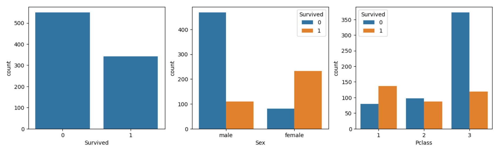
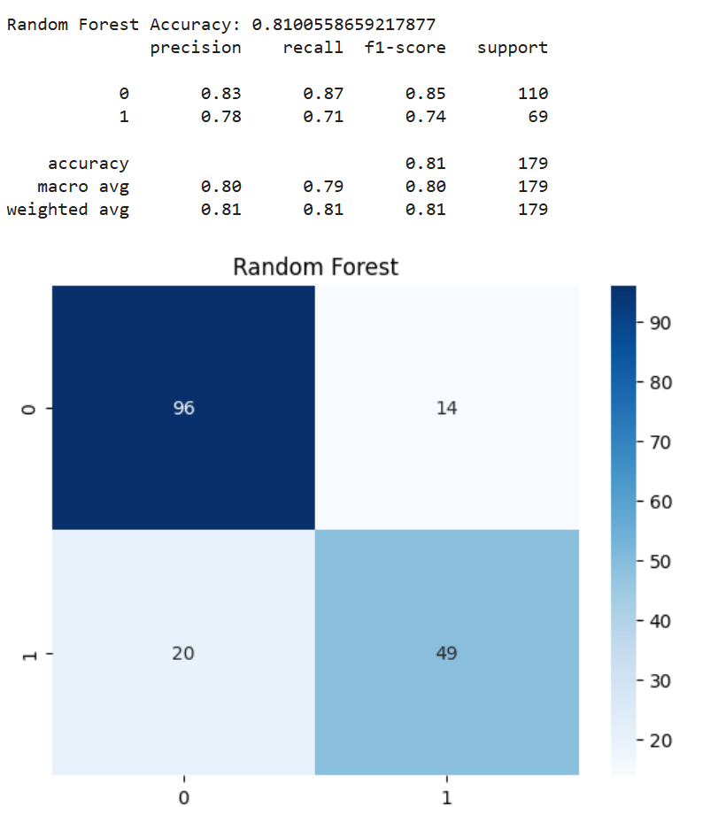
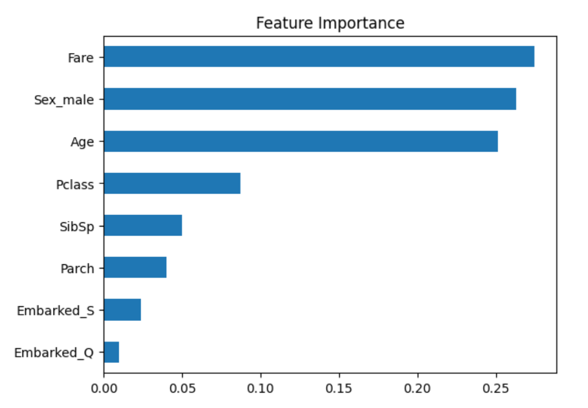
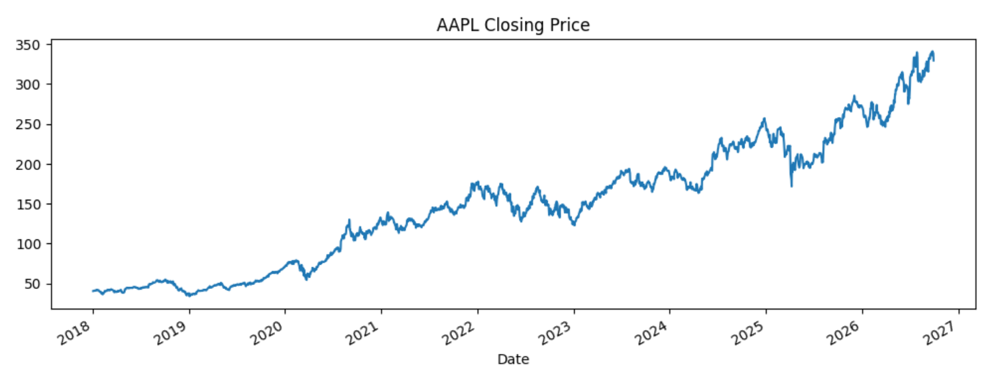
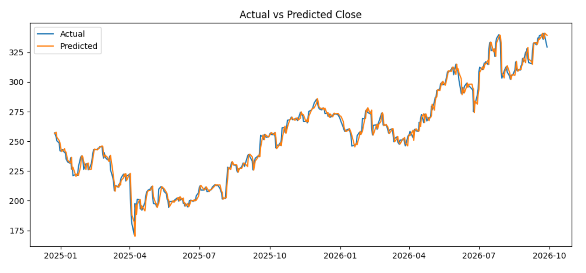

# Data Science Internship: Month 1


This repository contains my Month 1 work for the **Data Science Internship at Arch Technologies**. It includes two end-to-end machine learning projects: a **classification** model (Titanic survival) and a **regression** model (Apple stock price). Both projects cover data loading, exploration, cleaning, modeling, evaluation and interpretation.

---

## Table of Contents

- [Projects at a Glance](#projects-at-a-glance)
- [Task 1: Titanic Survival Classification](#task-1-titanic-survival-classification)
- [Task 2: Stock Price Prediction (AAPL)](#task-2-stock-price-prediction-aapl)
- [Tools and Technologies](#tools-and-technologies)
- [Repository Structure](#repository-structure)
- [How to Run](#how-to-run)
- [Key Learnings](#key-learnings)
- [Limitations and Future Work](#limitations-and-future-work)
- [Author](#author)

---

## Projects at a Glance

| | Task 1: Titanic | Task 2: Stock Prediction |
|---|---|---|
| **Problem type** | Binary classification | Regression |
| **Goal** | Predict whether a passenger survived | Predict the next day's closing price of AAPL |
| **Data** | Kaggle `train.csv` (891 rows, 12 columns) | Yahoo Finance via `yfinance` (2,197 trading days, 2018 to 2026; 2,196 rows used for modeling) |
| **Models** | Logistic Regression, Random Forest | Linear Regression (compared with a naive baseline) |
| **Best result** | **81.0% accuracy** (Random Forest) | **R² = 0.986**, RMSE = 4.66 (naive baseline: R² = 0.987, RMSE = 4.57) |
| **Notebook** | `Task1_Titanic.ipynb` | `Task2_Stock.ipynb` |

---

## Task 1: Titanic Survival Classification

**Objective:** Predict whether a passenger survived the Titanic disaster using details such as class, sex, age, family size, fare and port of embarkation.

### Dataset
The `train.csv` file from the Kaggle competition [Titanic: Machine Learning from Disaster](https://www.kaggle.com/competitions/titanic). Missing values were found in `Age` (177), `Cabin` (687) and `Embarked` (2).

### Workflow
1. **Load and explore** the data (`shape`, `head`, `info`, missing values).
2. **Exploratory data analysis** with count plots for overall survival, survival by sex and survival by passenger class.
3. **Clean the data**
   - `Age`: filled with the median
   - `Embarked`: filled with the most frequent value (mode)
   - `Cabin`, `Name`, `Ticket`, `PassengerId`: dropped (mostly empty or identifiers)
4. **Encode** categorical features (`Sex`, `Embarked`) using one-hot encoding.
5. **Split** the data 80/20 with `stratify=y` and `random_state=42`.
6. **Train** Logistic Regression and Random Forest (200 trees).
7. **Evaluate** using accuracy, classification report and confusion matrix.
8. **Interpret** the Random Forest with feature importance.

### Exploratory Data Analysis



Survival by sex and by passenger class shows clear patterns: women and first-class passengers survived far more often.

### Results

| Model | Accuracy |
|---|---|
| Logistic Regression | 80.4% |
| Random Forest | **81.0%** |

**Random Forest confusion matrix (179 test passengers):**

| | Predicted: Died | Predicted: Survived |
|---|---|---|
| **Actual: Died** | 96 | 14 |
| **Actual: Survived** | 20 | 49 |



### Feature Importance



### Key Findings
- Women and first-class passengers survived at much higher rates.
- The most important features were **Fare, Sex and Age**, followed by passenger class.
- Both models predict non-survivors better than survivors (recall 0.87 vs 0.71 for Random Forest), which is expected because the dataset has fewer survivors.

---

## Task 2: Stock Price Prediction (AAPL)

**Objective:** Predict Apple's next-day closing price from the current day's Open, High, Low, Close and Volume.

### Dataset
Historical AAPL prices from **2018-01-01 to 2026-09-30**, downloaded with the `yfinance` library (2,197 trading days). After removing the last row, which has no next-day target, **2,196 rows** were used for modeling.

### Workflow
1. **Download** the data and inspect it with `head()` and `describe()`.
2. **Visualize** the closing price history.
3. **Pre-process:** create a `Target` column with the next day's close (`shift(-1)`) and drop the last row.
4. **Time-based split:** first 80% of dates for training (1,756 rows), last 20% for testing (440 rows). The data is **not shuffled**, to avoid leaking future information into training.
5. **Train** a Linear Regression model.
6. **Evaluate** with MAE, RMSE and R².
7. **Compare with a naive baseline** that predicts tomorrow's close as today's close.
8. **Plot** actual vs predicted prices on the test period.

### AAPL Closing Price History



### Results

| Metric | Linear Regression | Naive baseline |
|---|---|---|
| MAE | 3.21 | 3.14 |
| RMSE | 4.66 | 4.57 |
| R² | 0.986 | 0.987 |

### Actual vs Predicted



### Important Note on These Results
The high R² should be read with care. Stock prices change slowly from one day to the next, so a model that uses today's close will naturally land close to tomorrow's close. A naive baseline that simply repeats today's close scores slightly better than the model (see Results), which shows that the model mostly repeats the previous price. Stock prices are also noisy and driven by news and market events that this model cannot see. **This project is for learning purposes and is not financial advice or a trading strategy.**

---

## Tools and Technologies

- **Language:** Python
- **Environment:** Google Colab
- **Data handling:** pandas, NumPy
- **Visualization:** matplotlib, seaborn
- **Machine learning:** scikit-learn (Logistic Regression, Random Forest, Linear Regression, metrics)
- **Data source:** yfinance, Kaggle
- **Version control:** Git and GitHub

---

## Repository Structure

```
datascience-internship-month1/
├── Task1_Titanic.ipynb     # Titanic survival classification
├── Task2_Stock.ipynb       # AAPL stock price prediction
├── train.csv               # Titanic dataset (from Kaggle)
├── AAPL_2018_2026.csv      # AAPL data snapshot used in Task 2
├── requirements.txt        # Python libraries needed to run locally
├── LICENSE                 # MIT license
├── images/                 # Result screenshots used in this README
│   ├── eda_charts.png
│   ├── rf_confusion_matrix.png
│   ├── feature_importance.png
│   ├── stock_closing_price.png
│   └── actual_vs_predicted.png
└── README.md               # Project documentation
```

---

## How to Run

### Option 1: Google Colab (recommended)
1. Open [Google Colab](https://colab.research.google.com) and choose **File → Upload notebook**.
2. Upload `Task1_Titanic.ipynb` or `Task2_Stock.ipynb` from this repository.
3. For **Task 1**, upload `train.csv` using the Files panel on the left.
4. Run all cells with **Runtime → Run all**.

> **Note:** The Task 2 results in this repository were produced from a data snapshot downloaded on 7 October 2026 (`AAPL_2018_2026.csv`, 2,196 rows including the `Target` column). Re-running the notebook downloads fresh data from Yahoo Finance, so the numbers may differ slightly.

### Option 2: Run locally
```bash
# 1. Clone the repository
git clone https://github.com/maheenawan-dev/datascience-internship-month1.git
cd datascience-internship-month1

# 2. Install the required libraries
pip install -r requirements.txt

# 3. Start Jupyter and open a notebook
jupyter notebook
```

> **Note:** Task 2 downloads live data from Yahoo Finance, so it needs an internet connection. If `yfinance` is rate-limited, a stock CSV from Kaggle can be used instead.

---

## Key Learnings

- Cleaning data: handling missing values and removing columns that do not help prediction.
- Encoding categorical variables for machine learning models.
- Choosing the right split: random and stratified for classification, time-based for time series.
- Comparing models and reading precision, recall, F1 and confusion matrices instead of accuracy alone.
- Always comparing a model with a simple baseline: a high score (such as R² = 0.986) does not always mean a useful model.

---

## Limitations and Future Work

- **Titanic:** add engineered features (title from `Name`, family size), tune hyperparameters and use cross-validation.
- **Stock prediction:** the model did not beat the naive baseline. Possible next steps are adding technical indicators (moving averages, RSI), predicting returns instead of prices, testing on other stocks and trying an LSTM neural network.
- Both projects use a single train/test split; k-fold or walk-forward validation would give more reliable estimates.

---

## Author

**Maheen Irfan**
BS Information Technology student, Data Science Intern at Arch Technologies

- GitHub: [@maheenawan-dev](https://github.com/maheenawan-dev)
- LinkedIn: [Maheen Irfan](https://www.linkedin.com/in/maheen-irfan-332353405)

---

*Made as part of the Month 1 tasks of the Data Science Internship at Arch Technologies.*
